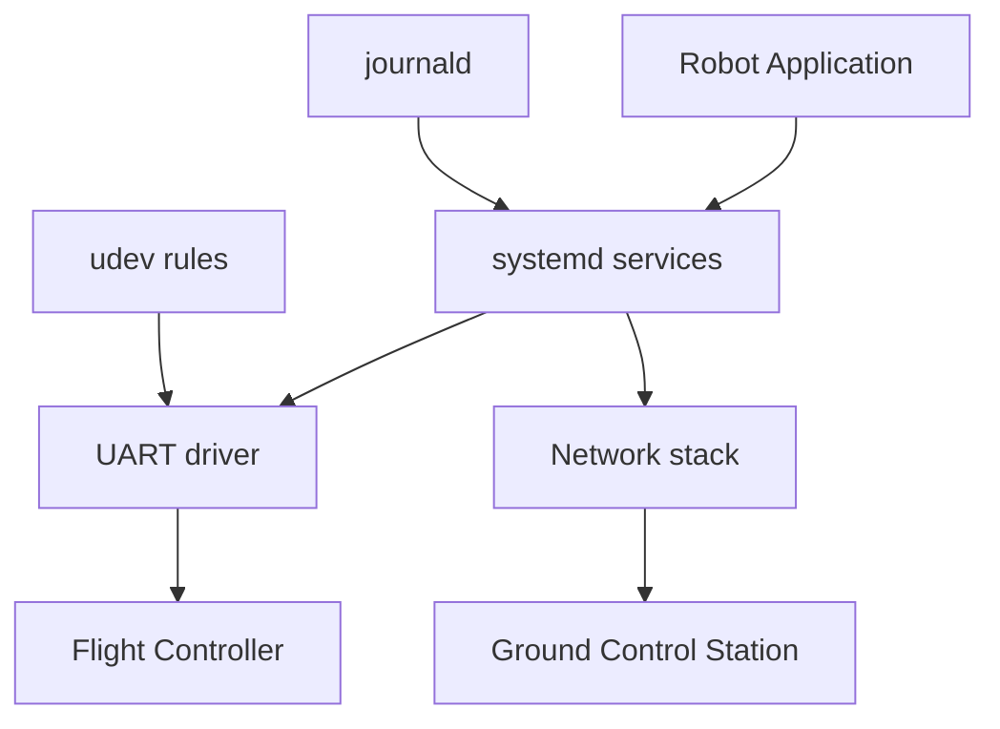

# 02. Linux для робототехніки

## Чому Linux

Практично всі роботичні та drone-системи побудовані на Linux або POSIX-сумісних ОС: Ubuntu на companion computer, Yocto/Petalinux на embedded, NuttX на мікроконтролерах. Розробник повинен вільно орієнтуватися в системі: налаштовувати сервіси, дебажити драйвери, захоплювати трафік, писати скрипти автоматизації.

## Теми модуля

- **systemd** — управління сервісами, автозапуск, логи, таймери.
- **udev** — правила для USB/serial-пристроїв, stable device names.
- **UART / SPI / I2C / CAN** — інтерфейси зв’язку з сенсорами і моторами.
- **GPIO** — керування пінами на embedded платах (Raspberry Pi, Jetson).
- **USB** — enumerating devices, permissions, libusb.
- **tcpdump / Wireshark** — аналіз мережевого трафіку, MAVLink, DDS.

## Архітектура Linux-робота



## systemd

systemd — це системний менеджер і набір інструментів для Linux. Для роботів він дозволяє автоматично запускати сервіси, перезапускати їх при падінні, зберігати логи та обмежувати ресурси.

```ini
[Unit]
Description=Drone Telemetry Service
After=network.target

[Service]
Type=simple
ExecStart=/usr/bin/python3 /opt/drone/telemetry.py
Restart=always
RestartSec=5
User=drone
Group=drone

[Install]
WantedBy=multi-user.target
```

Керування:

```bash
sudo systemctl enable drone-telemetry
sudo systemctl start drone-telemetry
sudo systemctl status drone-telemetry
sudo journalctl -u drone-telemetry -f
```

## udev

udev дозволяє створювати стабільні імена для пристроїв. Це важливо, бо `/dev/ttyUSB0` може змінитися на `/dev/ttyUSB1` після перепідключення.

```bash
# /etc/udev/rules.d/99-drone.rules
SUBSYSTEM=="tty", ATTRS{idVendor}=="2341", ATTRS{idProduct}=="0043", SYMLINK+="drone_radio", MODE="0666"
```

Перезавантаження правил:

```bash
sudo udevadm control --reload-rules
sudo udevadm trigger
```

## Читання з serial-пристрою

```python
import serial

with serial.Serial('/dev/drone_radio', 57600, timeout=1) as ser:
    while True:
        line = ser.readline()
        if line:
            print(line.decode('utf-8', errors='ignore').strip())
```

## CAN bus

CAN — шина, що використовується в автомобілях і роботах для надійного зв’язку з низькою латентністю. На Linux:

```bash
sudo ip link set can0 up type can bitrate 500000
```

## tcpdump для MAVLink

```bash
sudo tcpdump -i any -nn -s0 -w mavlink.pcap udp port 14550
```

## Ключові навички

- Створювати systemd unit-файли.
- Налаштовувати udev rules для /dev/ttyUSB*.
- Читати і писати в serial-пристрій через Python/C++.
- Захоплювати MAVLink/UDP пакети tcpdump.
- Налаштовувати CAN-інтерфейс на Linux.
- Дебажити сервіси через journalctl.

## Що вивчимо далі

У модулі 03 розглянемо мережеві протоколи, які використовують ці самі Linux-інтерфейси.


## Типові помилки

- Неправильне налаштування залежностей або середовища.
- Ігнорування обробки помилок і edge cases.
- Недостатнє логування, що ускладнює дебаг.
- Поганий вибір протоколу або формату даних.
- Неправильна робота з конкурентністю чи ресурсами.

## Best practices

- Завжди пишіть README з інструкцією запуску.
- Використовуйте Docker для відтворюваності середовища.
- Додавайте базові тести або чеклісти якості.
- Ведіть нотатки про вивчене і проблеми.
- Регулярно публікуйте прогрес у портфоліо.

## Додаткові вправи

1. Запишіть відео-розбір виконаного завдання.
2. Порівняйте своє рішення з існуючими open-source аналогами.
3. Додайте метрики продуктивності.
4. Опишіть, як масштабувати рішення на 10/100/1000 одиниць.
5. Підготуйте коротку презентацію для інтерв'ю.

## Корисні питання для інтерв'ю

- Чому саме такий підхід?
- Які альтернативи розглядали?
- Як би ви змінили рішення під обмеження по ресурсах?
- Які ризики безпеки чи відмови важливі в цьому модулі?
- Як ви тестували рішення в реальних або симульованих умовах?


## Поглиблений огляд

### Основні концепції модуля 02

У цьому модулі ми розглянули ключові технології та підходи, які використовуються в сучасних DefenseTech системах. Кожна тема має практичне застосування: від embedded Linux і мережевих протоколів до AI і DevOps. Розуміння цих концепцій дозволяє будувати end-to-end рішення: дрони, наземні станції, backend, аналітика і розгортання.

### Практичне застосування

Теорія модуля має бути закріплена практикою. Рекомендується виконати лабораторну роботу, практичне завдання і мініпроєкт. Кожен наступний рівень складніший і ближчий до реального проєкту. Лабораторна дає базові навички, практика вчить самостійно вирішувати проблеми, мініпроєкт формує портфоліо.

### Масштабування

Коли рішення працює локально, важливо подумати про масштабування. Скільки дронів може обслуговувати система? Які протоколи використовувати для флоту? Як забезпечити відмовостійкість? Ці питання ми розглядаємо в наступних модулях, але вже на цьому етапі варто замислюватися про архітектуру.

### Інтеграція з іншими модулями

Модуль 02 не існує ізольовано. Його знання поєднуються з попередніми і наступними модулями. Наприклад, Linux і мережі використовуються в MAVLink, Python/C++ — для backend, ROS2 і CV — для AI, а DevOps — для розгортання. Курс побудований так, щоб кожен модуль доповнював загальну картину.

### Інструменти для практики

Для закріплення матеріалу використовуйте SITL, реальні embedded плати (Raspberry Pi, Jetson), симулятори, Docker, Kubernetes і хмарні сервіси. Чим більше практики, тим краще розуміння. Документація та спільноти допоможуть розібратися зі складними моментами.

### Часті питання

**Чи потрібен реальний дрон для навчання?** Ні, для більшості завдань достатньо SITL і симуляторів. Реальний дрон потрібен лише на пізніших етапах або для конкретних тестів.

**Чи можна вивчати модулі не по порядку?** Можна, але рекомендується послідовність, оскільки модулі будуються один на одному.

**Скільки часу потрібно на модуль?** Залежно від рівня і глибини — від 1 до 3 тижнів при рекомендованому режимі 30 годин на тиждень.

**Як перевірити, що я засвоїв модуль?** Виконайте чекліст модуля і мініпроєкт. Якщо можете пояснити матеріал іншій людині — ви його засвоїли.

### Наступні кроки

Після завершення модуля перейдіть до наступного. Не поспішайте: краще глибоко вивчити менше, ніж поверхнево багато. Ведіть нотатки, публікуйте прогрес, будуйте портфоліо.
