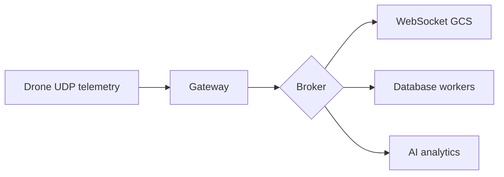

# 03. Мережі

## Мережеві протоколи в дронах

Зв’язок між дроном, наземною станцією і хмарою базується на різних протоколах залежно від вимог: латентність, надійність, пропускна здатність, топологія. DefenseTech-інженер повинен вибирати правильний інструмент для кожного каналу.

## Теми модуля

- **TCP** — надійний потоковий зв’язок (завантаження місій, конфігурація).
- **UDP** — швидка телеметрія з низькою затримкою.
- **WebSocket** — двосторонній зв’язок між GCS і backend.
- **MQTT** — pub/sub для IoT і флоту дронів.
- **RTSP / RTP** — відеопотік.
- **WebRTC** — low-latency відео та голос.
- **DDS** — розподілена комунікація в ROS2.
- **gRPC** — типізовані API між сервісами.
- **ZeroMQ** — легка брокер-less messaging.

## TCP vs UDP

| Характеристика | TCP | UDP |
|----------------|-----|-----|
| Надійність | Так | Ні |
| Порядок | Так | Ні |
| Латентність | Вища | Нижча |
| Використання | Конфігурація, файли | Телеметрія, відео |

## Телеметричний пайплайн



## MQTT для флоту

```python
import paho.mqtt.publish as publish

publish.single(
    "fleet/drone001/telemetry",
    '{"alt": 100, "battery": 87}',
    hostname="broker.local"
)
```

## WebSocket для GCS

```python
import asyncio
import websockets

async def handler(websocket, path):
    async for message in websocket:
        await websocket.send(f"echo: {message}")

async def main():
    async with websockets.serve(handler, "0.0.0.0", 8765):
        await asyncio.Future()

asyncio.run(main())
```

## DDS в ROS2

DDS — стандарт розподіленої комунікації. ROS2 використовує DDS як транспорт. Теми (topics) автоматично виявляють вузли в мережі. QoS-policies дозволяють налаштувати надійність, durability, deadline.

## Ключові навички

- Вибирати протокол під задачу.
- Реалізувати UDP-клієнт/сервер на Python.
- Налаштувати MQTT-брокер (Mosquitto).
- Писати WebSocket-сервер для live telemetry.
- Розуміти різницю між DDS, gRPC, ZeroMQ.
- Налаштовувати QoS в ROS2.

## Мініпроєкт

Telemetry streaming service.


## Типові помилки

- Неправильне налаштування залежностей або середовища.
- Ігнорування обробки помилок і edge cases.
- Недостатнє логування, що ускладнює дебаг.
- Поганий вибір протоколу або формату даних.
- Неправильна робота з конкурентністю чи ресурсами.

## Best practices

- Завжди пишіть README з інструкцією запуску.
- Використовуйте Docker для відтворюваності середовища.
- Додавайте базові тести або чеклісти якості.
- Ведіть нотатки про вивчене і проблеми.
- Регулярно публікуйте прогрес у портфоліо.

## Додаткові вправи

1. Запишіть відео-розбір виконаного завдання.
2. Порівняйте своє рішення з існуючими open-source аналогами.
3. Додайте метрики продуктивності.
4. Опишіть, як масштабувати рішення на 10/100/1000 одиниць.
5. Підготуйте коротку презентацію для інтерв'ю.

## Корисні питання для інтерв'ю

- Чому саме такий підхід?
- Які альтернативи розглядали?
- Як би ви змінили рішення під обмеження по ресурсах?
- Які ризики безпеки чи відмови важливі в цьому модулі?
- Як ви тестували рішення в реальних або симульованих умовах?


## Поглиблений огляд

### Основні концепції модуля 03

У цьому модулі ми розглянули ключові технології та підходи, які використовуються в сучасних DefenseTech системах. Кожна тема має практичне застосування: від embedded Linux і мережевих протоколів до AI і DevOps. Розуміння цих концепцій дозволяє будувати end-to-end рішення: дрони, наземні станції, backend, аналітика і розгортання.

### Практичне застосування

Теорія модуля має бути закріплена практикою. Рекомендується виконати лабораторну роботу, практичне завдання і мініпроєкт. Кожен наступний рівень складніший і ближчий до реального проєкту. Лабораторна дає базові навички, практика вчить самостійно вирішувати проблеми, мініпроєкт формує портфоліо.

### Масштабування

Коли рішення працює локально, важливо подумати про масштабування. Скільки дронів може обслуговувати система? Які протоколи використовувати для флоту? Як забезпечити відмовостійкість? Ці питання ми розглядаємо в наступних модулях, але вже на цьому етапі варто замислюватися про архітектуру.

### Інтеграція з іншими модулями

Модуль 03 не існує ізольовано. Його знання поєднуються з попередніми і наступними модулями. Наприклад, Linux і мережі використовуються в MAVLink, Python/C++ — для backend, ROS2 і CV — для AI, а DevOps — для розгортання. Курс побудований так, щоб кожен модуль доповнював загальну картину.

### Інструменти для практики

Для закріплення матеріалу використовуйте SITL, реальні embedded плати (Raspberry Pi, Jetson), симулятори, Docker, Kubernetes і хмарні сервіси. Чим більше практики, тим краще розуміння. Документація та спільноти допоможуть розібратися зі складними моментами.

### Часті питання

**Чи потрібен реальний дрон для навчання?** Ні, для більшості завдань достатньо SITL і симуляторів. Реальний дрон потрібен лише на пізніших етапах або для конкретних тестів.

**Чи можна вивчати модулі не по порядку?** Можна, але рекомендується послідовність, оскільки модулі будуються один на одному.

**Скільки часу потрібно на модуль?** Залежно від рівня і глибини — від 1 до 3 тижнів при рекомендованому режимі 30 годин на тиждень.

**Як перевірити, що я засвоїв модуль?** Виконайте чекліст модуля і мініпроєкт. Якщо можете пояснити матеріал іншій людині — ви його засвоїли.

### Наступні кроки

Після завершення модуля перейдіть до наступного. Не поспішайте: краще глибоко вивчити менше, ніж поверхнево багато. Ведіть нотатки, публікуйте прогрес, будуйте портфоліо.
