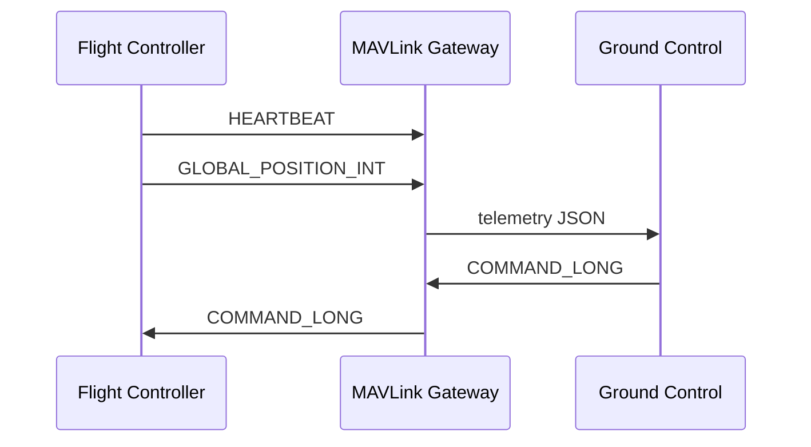

# 06. MAVLink

## Що таке MAVLink

MAVLink — легкий протокол обміну повідомленнями для дронів і автономних систем. Використовується між flight controller, GCS, onboard companion computer і хмарою. Має дві версії: MAVLink 1 (стара) і MAVLink 2 (сучасна, з підписами і більшими повідомленнями).

## Ключові повідомлення

- **HEARTBEAT** — стан системи, тип автопілота, режим.
- **GLOBAL_POSITION_INT** — GPS-координати.
- **BATTERY_STATUS** — стан батареї.
- **MISSION_ITEM / MISSION_ITEM_INT** — точка маршруту.
- **COMMAND_LONG / COMMAND_INT** — команди автопілоту.
- **PARAM_VALUE / PARAM_SET** — параметри.
- **ATTITUDE** — орієнтація дрона.
- **VFR_HUD** — швидкість, висота, курс.

## Структура MAVLink-повідомлення

MAVLink 2 повідомлення має:
- magic byte (0xFD)
- payload length
- incompatibility flags
- compatibility flags
- sequence
- system ID
- component ID
- message ID (3 bytes)
- payload
- checksum (2 bytes)
- signature (13 bytes, опціонально)

## Потік даних



## Приклад: heartbeat

```python
from pymavlink import mavutil

conn = mavutil.mavlink_connection('udp:127.0.0.1:14550')
conn.wait_heartbeat()
print(f"Heartbeat from system {conn.target_system} component {conn.target_component}")
```

## Приклад: парсинг GPS

```python
from pymavlink import mavutil

conn = mavutil.mavlink_connection('udp:127.0.0.1:14550')
while True:
    msg = conn.recv_match(type='GLOBAL_POSITION_INT', blocking=True)
    print(f"lat={msg.lat/1e7} lon={msg.lon/1e7} alt={msg.alt/1000}")
```

## Відправка команди

```python
conn.mav.command_long_send(
    conn.target_system, conn.target_component,
    mavutil.mavlink.MAV_CMD_NAV_LAND, 0,
    0, 0, 0, 0, 0, 0, 0
)
```

## Мініпроєкт

Python MAVLink Gateway між дроном і backend.


## Типові помилки

- Неправильне налаштування залежностей або середовища.
- Ігнорування обробки помилок і edge cases.
- Недостатнє логування, що ускладнює дебаг.
- Поганий вибір протоколу або формату даних.
- Неправильна робота з конкурентністю чи ресурсами.

## Best practices

- Завжди пишіть README з інструкцією запуску.
- Використовуйте Docker для відтворюваності середовища.
- Додавайте базові тести або чеклісти якості.
- Ведіть нотатки про вивчене і проблеми.
- Регулярно публікуйте прогрес у портфоліо.

## Додаткові вправи

1. Запишіть відео-розбір виконаного завдання.
2. Порівняйте своє рішення з існуючими open-source аналогами.
3. Додайте метрики продуктивності.
4. Опишіть, як масштабувати рішення на 10/100/1000 одиниць.
5. Підготуйте коротку презентацію для інтерв'ю.

## Корисні питання для інтерв'ю

- Чому саме такий підхід?
- Які альтернативи розглядали?
- Як би ви змінили рішення під обмеження по ресурсах?
- Які ризики безпеки чи відмови важливі в цьому модулі?
- Як ви тестували рішення в реальних або симульованих умовах?


## Поглиблений огляд

### Основні концепції модуля 06

У цьому модулі ми розглянули ключові технології та підходи, які використовуються в сучасних DefenseTech системах. Кожна тема має практичне застосування: від embedded Linux і мережевих протоколів до AI і DevOps. Розуміння цих концепцій дозволяє будувати end-to-end рішення: дрони, наземні станції, backend, аналітика і розгортання.

### Практичне застосування

Теорія модуля має бути закріплена практикою. Рекомендується виконати лабораторну роботу, практичне завдання і мініпроєкт. Кожен наступний рівень складніший і ближчий до реального проєкту. Лабораторна дає базові навички, практика вчить самостійно вирішувати проблеми, мініпроєкт формує портфоліо.

### Масштабування

Коли рішення працює локально, важливо подумати про масштабування. Скільки дронів може обслуговувати система? Які протоколи використовувати для флоту? Як забезпечити відмовостійкість? Ці питання ми розглядаємо в наступних модулях, але вже на цьому етапі варто замислюватися про архітектуру.

### Інтеграція з іншими модулями

Модуль 06 не існує ізольовано. Його знання поєднуються з попередніми і наступними модулями. Наприклад, Linux і мережі використовуються в MAVLink, Python/C++ — для backend, ROS2 і CV — для AI, а DevOps — для розгортання. Курс побудований так, щоб кожен модуль доповнював загальну картину.

### Інструменти для практики

Для закріплення матеріалу використовуйте SITL, реальні embedded плати (Raspberry Pi, Jetson), симулятори, Docker, Kubernetes і хмарні сервіси. Чим більше практики, тим краще розуміння. Документація та спільноти допоможуть розібратися зі складними моментами.

### Часті питання

**Чи потрібен реальний дрон для навчання?** Ні, для більшості завдань достатньо SITL і симуляторів. Реальний дрон потрібен лише на пізніших етапах або для конкретних тестів.

**Чи можна вивчати модулі не по порядку?** Можна, але рекомендується послідовність, оскільки модулі будуються один на одному.

**Скільки часу потрібно на модуль?** Залежно від рівня і глибини — від 1 до 3 тижнів при рекомендованому режимі 30 годин на тиждень.

**Як перевірити, що я засвоїв модуль?** Виконайте чекліст модуля і мініпроєкт. Якщо можете пояснити матеріал іншій людині — ви його засвоїли.

### Наступні кроки

Після завершення модуля перейдіть до наступного. Не поспішайте: краще глибоко вивчити менше, ніж поверхнево багато. Ведіть нотатки, публікуйте прогрес, будуйте портфоліо.
