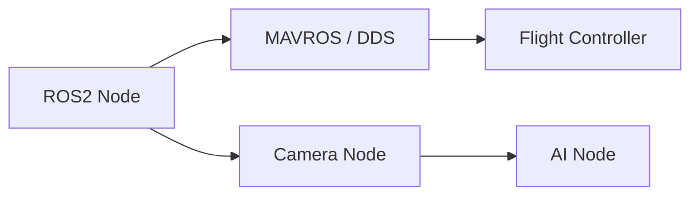

# 09. ROS2

## ROS2 для роботів і дронів

ROS2 (Robot Operating System 2) — фреймворк для побудови розподілених роботичних додатків. Використовує DDS як транспорт, підтримує real-time, security, lifecycle.

## Теми модуля

- **Nodes** — вузли обчислень.
- **Topics** — pub/sub канали.
- **Services** — синхронні запити.
- **Actions** — довготривалі задачі.
- **tf2** — трансформації координат.
- **Launch** — запуск груп вузлів.

## ROS2 + Drone



## ROS2 workspace

```bash
mkdir -p ~/ros2_ws/src
cd ~/ros2_ws
colcon build
source install/setup.bash
```

## Launch file

```python
from launch import LaunchDescription
from launch_ros.actions import Node

def generate_launch_description():
    return LaunchDescription([
        Node(package='drone_bridge', executable='telemetry_node'),
        Node(package='drone_bridge', executable='command_node'),
    ])
```

## Service

```python
from example_interfaces.srv import AddTwoInts

service = node.create_service(AddTwoInts, 'add_two_ints', callback)
```

## Actions

Actions використовуються для довготривалих задач: зліт, посадка, політ до точки.

## Мініпроєкт

Telemetry bridge на ROS2.


## Типові помилки

- Неправильне налаштування залежностей або середовища.
- Ігнорування обробки помилок і edge cases.
- Недостатнє логування, що ускладнює дебаг.
- Поганий вибір протоколу або формату даних.
- Неправильна робота з конкурентністю чи ресурсами.

## Best practices

- Завжди пишіть README з інструкцією запуску.
- Використовуйте Docker для відтворюваності середовища.
- Додавайте базові тести або чеклісти якості.
- Ведіть нотатки про вивчене і проблеми.
- Регулярно публікуйте прогрес у портфоліо.

## Додаткові вправи

1. Запишіть відео-розбір виконаного завдання.
2. Порівняйте своє рішення з існуючими open-source аналогами.
3. Додайте метрики продуктивності.
4. Опишіть, як масштабувати рішення на 10/100/1000 одиниць.
5. Підготуйте коротку презентацію для інтерв'ю.

## Корисні питання для інтерв'ю

- Чому саме такий підхід?
- Які альтернативи розглядали?
- Як би ви змінили рішення під обмеження по ресурсах?
- Які ризики безпеки чи відмови важливі в цьому модулі?
- Як ви тестували рішення в реальних або симульованих умовах?


## Поглиблений огляд

### Основні концепції модуля 09

У цьому модулі ми розглянули ключові технології та підходи, які використовуються в сучасних DefenseTech системах. Кожна тема має практичне застосування: від embedded Linux і мережевих протоколів до AI і DevOps. Розуміння цих концепцій дозволяє будувати end-to-end рішення: дрони, наземні станції, backend, аналітика і розгортання.

### Практичне застосування

Теорія модуля має бути закріплена практикою. Рекомендується виконати лабораторну роботу, практичне завдання і мініпроєкт. Кожен наступний рівень складніший і ближчий до реального проєкту. Лабораторна дає базові навички, практика вчить самостійно вирішувати проблеми, мініпроєкт формує портфоліо.

### Масштабування

Коли рішення працює локально, важливо подумати про масштабування. Скільки дронів може обслуговувати система? Які протоколи використовувати для флоту? Як забезпечити відмовостійкість? Ці питання ми розглядаємо в наступних модулях, але вже на цьому етапі варто замислюватися про архітектуру.

### Інтеграція з іншими модулями

Модуль 09 не існує ізольовано. Його знання поєднуються з попередніми і наступними модулями. Наприклад, Linux і мережі використовуються в MAVLink, Python/C++ — для backend, ROS2 і CV — для AI, а DevOps — для розгортання. Курс побудований так, щоб кожен модуль доповнював загальну картину.

### Інструменти для практики

Для закріплення матеріалу використовуйте SITL, реальні embedded плати (Raspberry Pi, Jetson), симулятори, Docker, Kubernetes і хмарні сервіси. Чим більше практики, тим краще розуміння. Документація та спільноти допоможуть розібратися зі складними моментами.

### Часті питання

**Чи потрібен реальний дрон для навчання?** Ні, для більшості завдань достатньо SITL і симуляторів. Реальний дрон потрібен лише на пізніших етапах або для конкретних тестів.

**Чи можна вивчати модулі не по порядку?** Можна, але рекомендується послідовність, оскільки модулі будуються один на одному.

**Скільки часу потрібно на модуль?** Залежно від рівня і глибини — від 1 до 3 тижнів при рекомендованому режимі 30 годин на тиждень.

**Як перевірити, що я засвоїв модуль?** Виконайте чекліст модуля і мініпроєкт. Якщо можете пояснити матеріал іншій людині — ви його засвоїли.

### Наступні кроки

Після завершення модуля перейдіть до наступного. Не поспішайте: краще глибоко вивчити менше, ніж поверхнево багато. Ведіть нотатки, публікуйте прогрес, будуйте портфоліо.
