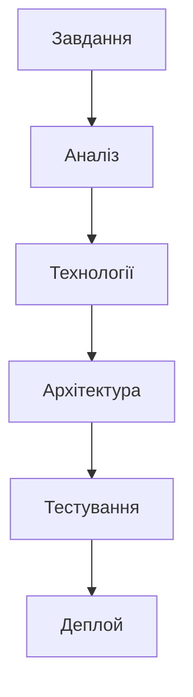

# Реальний сценарій 14

## Сценарій

Оператор управляє флотом через веб-інтерфейс. Потрібна мапа, live telemetry, планування місій, відео, alerts.

## Завдання

1. Визначте ключові компоненти системи.
2. Виберіть технології з модуля.
3. Побудуйте архітектуру рішення.
4. Виділіть ризики та обмеження.
5. Запропонуйте спосіб тестування.

## Архітектура

## Що врахувати

- Масштаб: кількість дронів, користувачів, даних.
- Латентність: real-time vs near real-time вимоги.
- Надійність: failsafe, retry, redundancy.
- Безпека: автентифікація, шифрування, access control.
- Вартість: інфраструктура, ліцензії, обслуговування.

## Результат

Схема рішення, список технологій, план тестування, опис ризиків. Розмістіть у нотатках або презентації.
