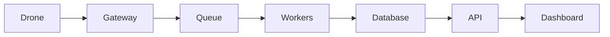

# Проєкт 01-telemetry-service: Telemetry Service

## Опис

Сервіс для збирання, збереження та роздачі телеметрії з дронів у реальному часі.

## Функціональність

- UDP/MAVLink listener
- Message queue
- Database workers
- REST API
- WebSocket live feed
- Dashboard

## Архітектура

## Технологічний стек

- Python / FastAPI або Node.js / NestJS
- PostgreSQL / Redis
- RabbitMQ / Kafka
- Docker / Kubernetes
- React / Next.js / Leaflet
- Prometheus / Grafana

## Етапи реалізації

1. Проєктування API та схеми даних.
2. Реалізація core функціоналу.
3. Інтеграція з дроном / SITL.
4. Тестування та дебаг.
5. Документація, Docker, CI/CD.
6. Деплой та демо.

## Критерії готовності

- [ ] Код у публічному репозиторії.
- [ ] README з інструкцією запуску.
- [ ] Docker Compose або Kubernetes маніфести.
- [ ] CI/CD pipeline.
- [ ] Тести або чекліст якості.
- [ ] Демо: скріншот, відео або live URL.

## Критерії приймання (DoD)

- [ ] Невалідні дані (battery=150, lat=100) відхиляються з 422 — доведено тестом
- [ ] WebSocket-подія доходить до двох клієнтів одночасно
- [ ] Повторна доставка того самого кадру не створює дубля в БД (ON CONFLICT)
- [ ] Заміряно p95 ingest-латентності і внесено в README
- [ ] `docker compose up` піднімає сервіс і БД однією командою

## Стартовий код

- `04-python/solution/main.py` — модель і сховище телеметрії
- `10-backend/solution/main.py` — lifespan, черга, публікація
- `capstone/backend/main.py` — WebSocket-розсилка

## Рекомендації

- Починайте з мінімального viable продукту.
- Використовуйте SITL для тестування без реального дрона.
- Додайте логування та моніторинг з першого дня.
- Документуйте API з OpenAPI/Swagger.
- Покрийте код тестами поступово.

## Складність

**Рівень:** Intermediate — Advanced
**Час:** 2–6 тижнів залежно від глибини.
