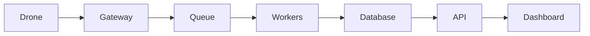

# Проєкт 02-mission-service: Mission Service

## Опис

API для планування, зберігання та виконання польотних місій.

## Функціональність

- Mission CRUD
- Waypoint validation
- Geofence
- Flight plan upload
- Execution status
- Integration with ArduPilot/PX4

## Архітектура

## Технологічний стек

- Python / FastAPI або Node.js / NestJS
- PostgreSQL / Redis
- RabbitMQ / Kafka
- Docker / Kubernetes
- React / Next.js / Leaflet
- Prometheus / Grafana

## Етапи реалізації

1. Проєктування API та схеми даних.
2. Реалізація core функціоналу.
3. Інтеграція з дроном / SITL.
4. Тестування та дебаг.
5. Документація, Docker, CI/CD.
6. Деплой та демо.

## Критерії готовності

- [ ] Код у публічному репозиторії.
- [ ] README з інструкцією запуску.
- [ ] Docker Compose або Kubernetes маніфести.
- [ ] CI/CD pipeline.
- [ ] Тести або чекліст якості.
- [ ] Демо: скріншот, відео або live URL.

## Критерії приймання (DoD)

- [ ] Місія з 1 точкою або несумірними seq відхиляється
- [ ] Місія за межами геозони відхиляється з поясненням
- [ ] Завантаження місії на фейковий дрон підтверджується MISSION_ACK у тесті
- [ ] OpenAPI-схема відкривається на `/docs`
- [ ] Контрактні тести зелені без SITL

## Стартовий код

- `13-ai/solution/mission_prompt.py` — Pydantic-схема місії
- `07-ardupilot/solution/ardupilot_api.py` — ін’єкція дрона і команди

## Рекомендації

- Починайте з мінімального viable продукту.
- Використовуйте SITL для тестування без реального дрона.
- Додайте логування та моніторинг з першого дня.
- Документуйте API з OpenAPI/Swagger.
- Покрийте код тестами поступово.

## Складність

**Рівень:** Intermediate — Advanced
**Час:** 2–6 тижнів залежно від глибини.
