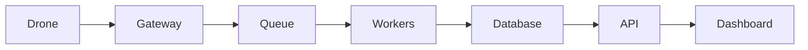

# Проєкт 03-fleet-manager: Fleet Manager

## Опис

Система управління флотом безпілотників: реєстрація, статус, групи, задачі.

## Функціональність

- Drone registry
- Fleet grouping
- Health monitoring
- Command dispatch
- Maintenance logs
- Operator UI

## Архітектура

## Технологічний стек

- Python / FastAPI або Node.js / NestJS
- PostgreSQL / Redis
- RabbitMQ / Kafka
- Docker / Kubernetes
- React / Next.js / Leaflet
- Prometheus / Grafana

## Етапи реалізації

1. Проєктування API та схеми даних.
2. Реалізація core функціоналу.
3. Інтеграція з дроном / SITL.
4. Тестування та дебаг.
5. Документація, Docker, CI/CD.
6. Деплой та демо.

## Критерії готовності

- [ ] Код у публічному репозиторії.
- [ ] README з інструкцією запуску.
- [ ] Docker Compose або Kubernetes маніфести.
- [ ] CI/CD pipeline.
- [ ] Тести або чекліст якості.
- [ ] Демо: скріншот, відео або live URL.

## Критерії приймання (DoD)

- [ ] Реєстрація дрона і last-seen з TTL працюють (перевірено тестом)
- [ ] Дрон без кадрів >30 с позначається offline
- [ ] Агрегація стану флоту витримує 100 симульованих дронів
- [ ] Метрики флоту доступні через `/metrics`
- [ ] README містить схему потоків і приклад відповіді API

## Стартовий код

- `10-backend/solution/main.py` — приймання і публікація
- `capstone/backend/worker.py` — збереження стану в БД

## Рекомендації

- Починайте з мінімального viable продукту.
- Використовуйте SITL для тестування без реального дрона.
- Додайте логування та моніторинг з першого дня.
- Документуйте API з OpenAPI/Swagger.
- Покрийте код тестами поступово.

## Складність

**Рівень:** Intermediate — Advanced
**Час:** 2–6 тижнів залежно від глибини.
