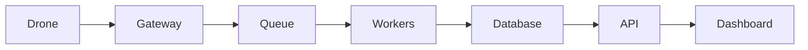

# Проєкт 04-ground-control-ui: Ground Control UI

## Опис

Веб-інтерфейс оператора для керування дронами на мапі.

## Функціональність

- Live map
- Telemetry panels
- Mission editor
- Video stream
- Alerts
- Multi-drone support

## Архітектура

## Технологічний стек

- Python / FastAPI або Node.js / NestJS
- PostgreSQL / Redis
- RabbitMQ / Kafka
- Docker / Kubernetes
- React / Next.js / Leaflet
- Prometheus / Grafana

## Етапи реалізації

1. Проєктування API та схеми даних.
2. Реалізація core функціоналу.
3. Інтеграція з дроном / SITL.
4. Тестування та дебаг.
5. Документація, Docker, CI/CD.
6. Деплой та демо.

## Критерії готовності

- [ ] Код у публічному репозиторії.
- [ ] README з інструкцією запуску.
- [ ] Docker Compose або Kubernetes маніфести.
- [ ] CI/CD pipeline.
- [ ] Тести або чекліст якості.
- [ ] Демо: скріншот, відео або live URL.

## Критерії приймання (DoD)

- [ ] Трейл обмежений 100 точками і не деградує після 10 000 кадрів
- [ ] Реконнект WebSocket із backoff; стан offline за ≤5 с
- [ ] Невалідний кадр не ламає мапу (валідація перед setState)
- [ ] `node --test` для логіки форматування зелений
- [ ] Мапа працює без зовнішнього інтернету (локальні тайли або кеш)

## Стартовий код

- `14-ground-control/solution/gcs-page.tsx` — компонент GCS
- `14-ground-control/solution/telemetry-format.mjs` — логіка під тестами

## Рекомендації

- Починайте з мінімального viable продукту.
- Використовуйте SITL для тестування без реального дрона.
- Додайте логування та моніторинг з першого дня.
- Документуйте API з OpenAPI/Swagger.
- Покрийте код тестами поступово.

## Складність

**Рівень:** Intermediate — Advanced
**Час:** 2–6 тижнів залежно від глибини.
