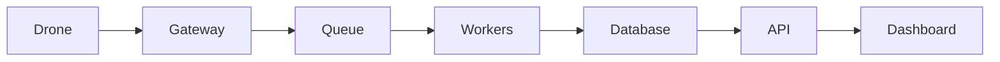

# Проєкт 07-video-analytics: Video Analytics

## Опис

Запис, зберігання, пошук та аналітика відео з дронів.

## Функціональність

- RTSP ingestion
- Video storage
- Timeline search
- Object detection indexing
- Playback UI
- Export

## Архітектура

## Технологічний стек

- Python / FastAPI або Node.js / NestJS
- PostgreSQL / Redis
- RabbitMQ / Kafka
- Docker / Kubernetes
- React / Next.js / Leaflet
- Prometheus / Grafana

## Етапи реалізації

1. Проєктування API та схеми даних.
2. Реалізація core функціоналу.
3. Інтеграція з дроном / SITL.
4. Тестування та дебаг.
5. Документація, Docker, CI/CD.
6. Деплой та демо.

## Критерії готовності

- [ ] Код у публічному репозиторії.
- [ ] README з інструкцією запуску.
- [ ] Docker Compose або Kubernetes маніфести.
- [ ] CI/CD pipeline.
- [ ] Тести або чекліст якості.
- [ ] Демо: скріншот, відео або live URL.

## Критерії приймання (DoD)

- [ ] RTSP-потік відновлюється після обриву без перезапуску процесу
- [ ] Політика пропуску кадрів не дає черзі рости безмежно
- [ ] FPS і кількість оброблених кадрів експортуються як метрики
- [ ] Події пишуться в JSON-лог з часовими мітками
- [ ] Тест на reconnect проходить у CI без реальної камери

## Стартовий код

- `12-computer-vision/examples/yolo_opencv.py` — детекція OpenCV DNN
- `capstone/gateway/gateway.py` — приклад обробки потокового джерела

## Рекомендації

- Починайте з мінімального viable продукту.
- Використовуйте SITL для тестування без реального дрона.
- Додайте логування та моніторинг з першого дня.
- Документуйте API з OpenAPI/Swagger.
- Покрийте код тестами поступово.

## Складність

**Рівень:** Intermediate — Advanced
**Час:** 2–6 тижнів залежно від глибини.
