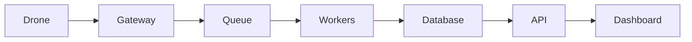

# Проєкт 10-defense-dashboard: Defense Dashboard

## Опис

Єдиний dashboard для оператора з телеметрією, відео, AI-аналітикою та алертами.

## Функціональність

- Multi-source data fusion
- Real-time widgets
- Map layers
- Alert management
- Role-based access
- Mobile support

## Архітектура

## Технологічний стек

- Python / FastAPI або Node.js / NestJS
- PostgreSQL / Redis
- RabbitMQ / Kafka
- Docker / Kubernetes
- React / Next.js / Leaflet
- Prometheus / Grafana

## Етапи реалізації

1. Проєктування API та схеми даних.
2. Реалізація core функціоналу.
3. Інтеграція з дроном / SITL.
4. Тестування та дебаг.
5. Документація, Docker, CI/CD.
6. Деплой та демо.

## Критерії готовності

- [ ] Код у публічному репозиторії.
- [ ] README з інструкцією запуску.
- [ ] Docker Compose або Kubernetes маніфести.
- [ ] CI/CD pipeline.
- [ ] Тести або чекліст якості.
- [ ] Демо: скріншот, відео або live URL.

## Критерії приймання (DoD)

- [ ] Дашборд агрегує телеметрію і тривоги з реального API
- [ ] Критичні тривоги видно без прокрутки (пріоритети)
- [ ] Оновлення даних ≤2 с від появи кадру в БД
- [ ] `docker compose up` піднімає дашборд разом зі стеком
- [ ] Метрики SLO (error rate, p95) видно на графіку

## Стартовий код

- `14-ground-control/solution/gcs-page.tsx` — основа UI
- `capstone/README.md` — стек і контракт даних

## Рекомендації

- Починайте з мінімального viable продукту.
- Використовуйте SITL для тестування без реального дрона.
- Додайте логування та моніторинг з першого дня.
- Документуйте API з OpenAPI/Swagger.
- Покрийте код тестами поступово.

## Складність

**Рівень:** Intermediate — Advanced
**Час:** 2–6 тижнів залежно від глибини.
