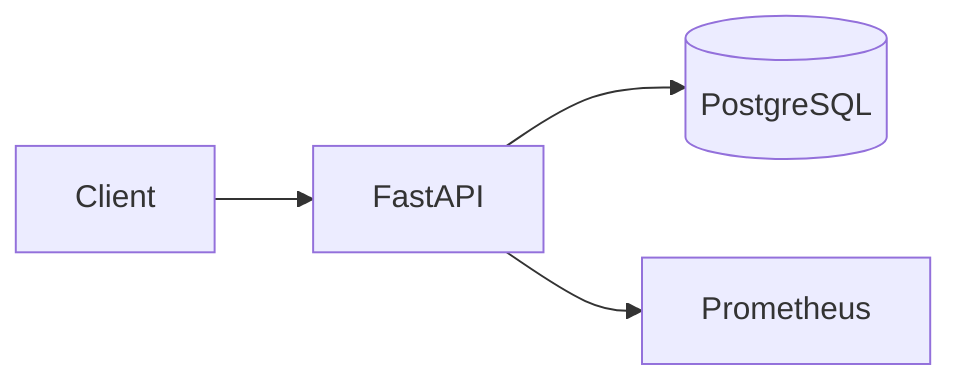

# Starter Template: DefenseTech Project

Мінімальний скелет портфоліо-проєкту: README, CI, тест і запускний код.
Копіюйте теку у свій репозиторій і замінюйте заглушки.

## Мета

Одне речення: яку задачу вирішує проєкт і для кого.

## Швидкий старт

```bash
python3 -m venv .venv
source .venv/bin/activate
pip install -r requirements.txt
uvicorn app:app --reload
```

Перевірка: `curl http://localhost:8000/health` → `{"status": "ok"}`.

## Архітектура



Опишіть потоки даних і місця, де можливі відмови.

## Метрики

| Метрика | Значення | Як заміряно |
|---|---|---|
| p95 latency | < 50 ms | `hey -n 1000` |
| Покриття тестами | > 70% | `pytest --cov` |

## Тести

```bash
pytest -q
```

## Обмеження

Що свідомо не реалізовано і чому.

## Ліцензія

MIT.
