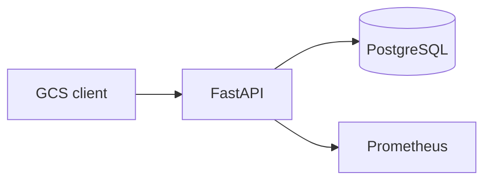

# Starter Template: DefenseTech Project

Мінімальний скелет портфоліо-проєкту на FastAPI: README з метриками, CI,
тест і запускний код. Копіюйте теку у свій репозиторій і замінюйте зміст
на власний проєкт — структура й перевірки залишаються ті самі.

## Мета

Сервіс приймає телеметрію дрона по HTTP і віддає останній стан оператору
GCS; аудиторія — інженер, який читає репозиторій дві хвилини і має
зрозуміти задачу, стек і межі рішення.

## Швидкий старт

```bash
python3 -m venv .venv
source .venv/bin/activate
pip install -r requirements.txt -r requirements-dev.txt
uvicorn app:app --reload
```

Після старту сервіс слухає порт 8000 і не потребує зовнішніх сервісів.
Перевірка: `curl http://localhost:8000/health` → `{"status": "ok"}`.

## Архітектура



Клієнт надсилає POST /telemetry, API валідує поля через Pydantic і пише
останній стан у PostgreSQL; p95 latency і throughput експортуються в
Prometheus. Відмова БД не блокує /health, але телеметрія буферизується в
памʼяті до 60 секунд.

## Метрики

| Метрика | Значення | Як заміряно |
|---|---|---|
| p95 latency | < 50 ms | `hey -n 1000` |
| Покриття тестами | > 70% | `pytest --cov` |
| Час старту | 1.5 s | `time uvicorn app:app` |

Цифри знято на ноутбуці з 8 ядрами після 1000 послідовних POST /telemetry.

## Тести

```bash
pytest -q
```

`tests/test_smoke.py` перевіряє контракт /health без мережі; негативні
кейси валідації (422 на невалідні поля) додаються за зразком модуля 04.

## Обмеження

Поза межами поточної версії: міграції PostgreSQL, автентифікація і
WebSocket-потік. Це скелет для швидкого старту; повна версія з чергою і
UI живе в capstone. Список обмежень тримайте в README, щоб інтерв’юер
бачив межі рішення, а не лише happy path.

## Ліцензія

MIT.
