# Learning Roadmap

A visual overview of the path from senior full-stack developer to DefenseTech engineer.

```mermaid
graph LR
    A[00 Introduction] --> B[01 DefenseTech Fundamentals]
    B --> C[02 Linux for Robotics]
    C --> D[03 Networking]
    D --> E[04 Python]
    E --> F[05 Modern C++]
    F --> G[06 MAVLink]
    G --> H[07 ArduPilot]
    G --> I[08 PX4]
    I --> J[09 ROS2]
    J --> K[10 Backend Systems]
    K --> L[11 Distributed Systems]
    L --> M[12 Computer Vision]
    M --> N[13 AI]
    N --> O[14 Ground Control Station]
    O --> P[15 DevOps]
    P --> Q[16 Portfolio Projects]
    Q --> R[17 Interview]
```

## Milestones

1. **Foundation** — complete modules 00–03.
2. **Core programming** — complete modules 04–05.
3. **Drone middleware** — complete modules 06–09.
4. **Enterprise backend** — complete modules 10–11.
5. **Intelligence layer** — complete modules 12–13.
6. **End-to-end system** — complete modules 14–15.
7. **Portfolio & interview** — complete modules 16–17.

## Portfolio projects

- Telemetry service
- Mission service
- Fleet manager
- Ground Control UI
- MAVLink gateway
- AI detection service
- Video analytics pipeline
- Flight log analyzer
- Drone AI agent
- Defense dashboard

## Success checklist

- [ ] Complete all modules
- [ ] Build 10 public GitHub projects
- [ ] Deploy services with Docker
- [ ] Demonstrate ArduPilot SITL integration
- [ ] Build AI-assisted Ground Control prototype
- [ ] Prepare CV focused on DefenseTech
