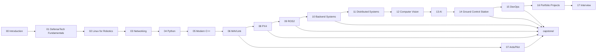

# Learning Roadmap

Visual path from senior full-stack developer to a Drone / Autopilot
Software engineer. One track, depth over breadth.

## Dependency graph

```mermaid
graph LR
    A[00 Introduction] --> B[01 DefenseTech Fundamentals]
    B --> C[02 Linux for Robotics]
    C --> D[03 Networking]
    D --> E[04 Python]
    E --> F[05 Modern C++]
    F --> G[06 MAVLink]
    G --> H[07 ArduPilot]
    G --> I[08 PX4]
    I --> J[09 ROS2]
    J --> K[10 Backend Systems]
    K --> L[11 Distributed Systems]
    L --> M[12 Computer Vision]
    M --> N[13 AI]
    N --> O[14 Ground Control Station]
    O --> P[15 DevOps]
    P --> Q[16 Portfolio Projects]
    Q --> R[17 Interview]

    H --> CAP[capstone/]
    I --> CAP
    J --> CAP
    K --> CAP
    O --> CAP
    P --> CAP
```

## Track Drone / Autopilot Software

| Stage | Modules | Exit artifact |
|---|---|---|
| Foundation | 00–03 | Environment, SITL, serial daemon, UDP/WS bridge |
| Core code | 04–05 | Telemetry API, C++ MAVLink parser with CRC test |
| Drone middleware | 06–09 | Gateway, ArduPilot REST, PX4 params/logs, ROS2 bridge |
| System | 10, 14–15 | Queue pipeline, GCS UI, container deploy |
| Career | 16–17 | Public portfolio, interview set |

Modules 11–13 are studied at outline level for this track; they become
deep only in the CV/AI or Backend tracks.

## Milestones (part-time, 12–15 h/week)

1. **Weeks 1–2 — Foundation.** SITL heartbeat, plan, serial daemon.
2. **Weeks 3–6 — Code.** FastAPI telemetry API, C++ parser.
3. **Weeks 7–14 — Drone middleware.** MAVLink gateway, ArduPilot commands,
   PX4 parameters and logs, ROS2 bridge.
4. **Weeks 15–20 — System.** Capstone pipeline, GCS UI, Docker/K8s.
5. **Weeks 21–26 — Career.** Portfolio, mock interviews, applications.

## Success checklist

- [ ] Capstone runs end-to-end with `docker compose up`
- [ ] `python scripts/run_lab_checks.py` shows 18 passed
- [ ] ArduPilot SITL smoke test passes locally
- [ ] Two public repositories with README, tests and CI
- [ ] One system design case (1000 drones) rehearsed out loud
- [ ] CV and GitHub profile point to the track
