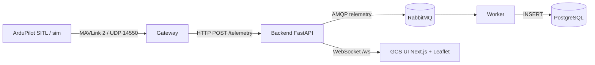

# Capstone: система телеметрії дрона

Наскрізний проєкт курсу: від MAVLink-потоку автопілота до живої
панелі оператора. Кожен модуль додає в нього один компонент, тому
capstone — це головний артефакт портфоліо, а не «ще один демо-стек».

## Архітектура



| Компонент | Що робить | Модуль курсу |
|---|---|---|
| `sim/` | генерує реалістичний MAVLink-потік без автопілота | 01, 06 |
| `gateway/` | MAVLink → JSON, ретраї, graceful shutdown | 06 |
| `backend/` | HTTP API, WebSocket, публікація в чергу | 04, 10 |
| `worker/` | черга → PostgreSQL, ack після запису | 10 |
| `frontend/` | мапа, телеметрія, трейл, стан лінку | 14 |
| `k8s/` | деплой у кластер | 15 |

## Швидкий старт (режим sim, без автопілота)

```bash
cd capstone
docker compose up --build
```

Далі відкрийте:

- http://localhost:3000 — GCS UI з живою телеметрією;
- http://localhost:8000/docs — OpenAPI backend;
- http://localhost:15672 — RabbitMQ UI (guest/guest).

Телеметрія з'явиться за 10–20 секунд: `sim` шле 5 кадрів/с.

## Режим справжнього SITL

```bash
cd capstone
COMPOSE_PROFILES=sitl docker compose up --build
```

ArduPilot SITL стартує у контейнері та надсилає MAVLink gateway-ю.
Перший heartbeat — за 30–60 секунд (SITL завантажується довше за sim).

Перевірка потоку окремо:

```bash
docker compose logs -f gateway
```

`scripts/sitl_smoke.py --source udp:127.0.0.1:14550` призначений для
локального SITL поза compose: у compose порт 14550/udp публікує gateway,
а SITL надсилає кадри всередині docker-мережі. Для перевірки через
сокет запустіть SITL локально з `--out=udp:127.0.0.1:14555` і вкажіть
цей порт у `--source`.

## Контракт

| Метод | Шлях | Призначення |
|---|---|---|
| POST | `/telemetry` | прийняти кадр, опублікувати в чергу, розіслати в WS; 202 |
| GET | `/health` | стан сервісу і кількість WS-клієнтів |
| WS | `/ws` | потік JSON-кадрів телеметрії |

Приклад кадру:

```json
{
  "type": "GLOBAL_POSITION_INT",
  "system_id": 1,
  "ts": "2026-09-23T17:00:00+00:00",
  "lat": 50.4501,
  "lon": 30.5234,
  "alt": 120.0,
  "heading": 90.0
}
```

## Тести

```bash
python -m pytest capstone/tests -q
```

Контрактні тести перевіряють API, WebSocket і мапінг MAVLink → JSON
без SITL і без Docker (MAVLink-фрейми генеруються pymavlink).

## Метрики для портфоліо

Виміряйте і внесіть у свій README:

- наскрізну затримку sim → UI (p95, мс);
- кількість кадрів/с під навантаженням;
- час відновлення після падіння backend;
- розмір запису в PostgreSQL за годину польоту.

## Обмеження

- Аутентифікації немає: capstone — навчальний, не запускайте в
  публічній мережі.
- UI фільтрує кадри за типом: позиція (GLOBAL_POSITION_INT) — на мапі
  й трейлі, решта типів оновлює панель телеметрії. Трейл обмежений
  100 точками.
- Місії та команди не реалізовані: це завдання модулів 07 і 16.
- Retention БД не налаштований: додайте за потреби самостійно.

## Що далі

1. Підключіть реальний flight controller замість SITL:
   `MAVLINK_SOURCE=udp:0.0.0.0:14550` і телеметрію на борту.
2. Додайте команди ARM/takeoff/RTL із модуля 07.
3. Підключіть CV-сервіс (модуль 12) як споживача відео.
