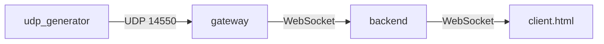

# Telemetry Demo

End-to-end demo: UDP telemetry generator → gateway → FastAPI backend → WebSocket client.

## Components

- `udp_generator.py` — sends fake MAVLink-like telemetry to UDP port 14550.
- `gateway.py` — receives UDP, parses JSON, forwards to WebSocket clients.
- `backend.py` — FastAPI with WebSocket endpoint.
- `client.html` — simple browser client to view live telemetry.

## Run

```bash
# Terminal 1: backend
python backend.py

# Terminal 2: gateway
python gateway.py

# Terminal 3: generator
python udp_generator.py

# Browser: open client.html
```

## Architecture


